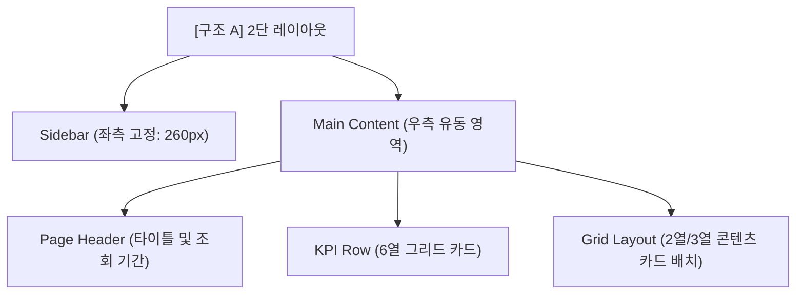
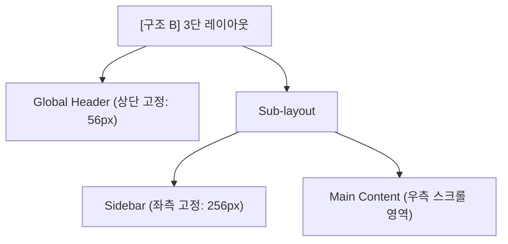

# 축산물 통합 시스템 제안 프로토타입 디자인 시스템 가이드

본 가이드는 **축산물 통합 시스템 및 농가정산 프로그램 제안 프로토타입**에 적용된 디자인/UI/UX 스타일을 다른 프로젝트에 쉽고 일관되게 적용할 수 있도록 정리한 디자인 시스템 가이드라인입니다.

본 가이드라인은 신뢰감 있고 직관적인 데이터 전달을 위한 **공공 기관 및 대시보드 중심의 UI/UX 설계**를 기반으로 하며, 세련된 느낌을 주는 **Ver 2.0 Visual Refresh** 스타일과 **다크 모드(Dark Mode)** 구성을 포함하고 있습니다.

---

## 📌 목차
1. [디자인 철학 및 핵심 컨셉](#1-디자인-철학-및-핵심-컨셉)
2. [디자인 토큰 (Design Tokens)](#2-디자인-토큰-design-tokens)
3. [레이아웃 시스템 (Layout System)](#3-레이아웃-시스템-layout-system)
4. [UI 컴포넌트 라이브러리 (UI Components)](#4-ui-컴포넌트-라이브러리-ui-components)
5. [다크 모드 적용 가이드 (Dark Mode)](#5-다크-모드-적용-가이드-dark-mode)
6. [마이크로 인터랙션 및 효과 (Interactions)](#6-마이크로-인터랙션-및-효과-interactions)

---

## 1. 디자인 철학 및 핵심 컨셉

*   **데이터의 가독성 극대화**: 수치 데이터, 등급 판정 결과, 통계 정보 등이 복잡하게 얽히지 않도록 충분한 여백(Whitespace)과 격자(Grid) 구조를 활용합니다.
*   **신뢰감을 주는 컬러 톤**: 깊이 있는 네이비(`--navy`)와 안정적인 블루(`--blue`) 계열을 메인 브랜드 컬러로 삼고, 경고나 핵심 강조 사항에 골드/오렌지(`--accent`), 레드(`--red`) 컬러를 매칭해 시각적 위계를 확보합니다.
*   **부드러운 입체감과 깊이 (Visual Refresh 2.0)**: 평면적인 플랫 디자인(Flat Design)을 넘어, 백드롭 블러(`backdrop-filter: blur`), 미세한 그라디언트, 은은하고 부드러운 이중 그림자(`box-shadow`) 효과를 적용하여 사용자에게 프리미엄 데스크톱 앱의 경험을 선사합니다.
*   **유연한 모드 전환**: 업무 환경에 따라 눈의 피로를 덜어주는 다크 모드 전환 환경을 완벽하게 지원하도록 CSS 변수를 설계하였습니다.

---

## 2. 디자인 토큰 (Design Tokens)

### 2.1 CSS Custom Properties (기본 테마 및 Visual Refresh)

새로운 프로젝트에 적용할 때 아래의 CSS 변수를 글로벌 스타일시트(예: `index.css`)의 `:root`에 정의하여 사용합니다.

```css
:root {
  /* Brand Colors (Visual Refresh 2.0) */
  --navy: #16466F;         /* 주요 헤더, 강한 텍스트, 활성 네비게이션용 딥 네이비 */
  --navy2: #256E9F;        /* 보조 아이콘, 서브 헤더용 미드 네이비 */
  --blue-light: #4C9DD8;   /* 긍정 상태, 메인 차트 포인트 블루 */
  --accent: #D99418;       /* 핵심 대기/주의/골드 포인트 오렌지 */
  --red: #D84C4C;          /* 경고, 오류, 거절 상태용 레드 */
  --green: #238A65;        /* 완료, 통과, 정상 상태용 그린 */
  
  /* Background & Surface Colors */
  --bg: #EEF3F7;           /* 전체 레이아웃 배경색 */
  --card: #FFFFFF;         /* 콘텐츠 카드, 표 등 컴포넌트 배경색 */
  --border: #D9E3EC;       /* 카드 테두리 및 구분선 컬러 */
  --text: #1D2B36;         /* 기본 본문 텍스트 (짙은 차콜) */
  --text-sub: #617284;     /* 부연 설명, 정보 텍스트 (다크 그레이) */
  
  /* Shadows (부드러운 입체감) */
  --shadow: 0 14px 34px rgba(24, 54, 83, .08);
  --shadow-soft: 0 8px 20px rgba(24, 54, 83, .06);
  
  /* Border Radius */
  --r-sm: 6px;
  --r-md: 10px;
  --r-lg: 14px;            /* 주요 카드 및 컴포넌트 모서리 곡률 */
}
```

### 2.2 공기업/공공기관 관리자 테마 (KEPCO ES PMS 기준)

조금 더 단단하고 차분한 시스템 관리를 목표로 할 때는 아래의 서브 토큰 세트(농가정산 화면 적용)를 권장합니다.

```css
:root {
  /* Brand */
  --navy: #0F3460;
  --blue: #1a5fb4;
  --blue-lt: #dde8f8;
  --blue-md: #7db0e8;
  --blue-dk: #103d80;
  --amber: #f5870a;
  --amber-lt: #fff1e0;
  --amber-dk: #c2660a;
  
  /* Semantic */
  --green: #16a34a;
  --green-lt: #e3f9ed;
  --green-dk: #0d7a3a;
  --red: #ef4444;
  --red-lt: #fdecec;
  --red-dk: #c0291a;
  
  /* Surface */
  --bg: #f5f7fa;
  --bg2: #ffffff;
  --text: #2d3748;
  --text-muted: #64748b;
  --border: #e2e8f0;
  --sidebar-bg: #eef1f6;
  
  /* Shadows */
  --shadow-card: 0 1px 3px rgba(15, 23, 42, .07), 0 1px 2px rgba(15, 23, 42, .04);
  --shadow-active: 0 6px 14px rgba(15, 52, 96, .24);
}
```

### 2.3 타이포그래피 (Typography)

*   **Font Family**: 시스템 기본 폰트와 한글 가독성이 우수한 `Noto Sans KR`을 혼용합니다.
    ```css
    body {
      font-family: 'Noto Sans KR', 'Malgun Gothic', 'Apple SD Gothic Neo', sans-serif;
      font-size: 13px; /* 혹은 대시보드 밀집도에 따라 14px~15px 사용 */
      line-height: 1.55;
    }
    ```
*   **Font Weight**:
    *   `900` / `800`: 메인 타이틀, KPI 핵심 수치
    *   `700`: 카드 제목, 표 머리글(Header), 주요 버튼
    *   `500`: 사이드바 내비게이션, 폼 레이블
    *   `400` / `300`: 본문 텍스트, 설명글

---

## 3. 레이아웃 시스템 (Layout System)

### 3.1 레이아웃 아키텍처

대시보드와 대형 프로그램 화면을 위해 두 가지 형태의 반응형 레이아웃 구조를 제공합니다.

#### 💡 [구조 A] 사이드바 + 메인 콘텐츠 2단 구성 (종합 모니터링 대시보드)
*   **특징**: 좌측에 고정된 사이드바가 위치하고 우측 전체를 메인 페이지 영역으로 씁니다.
*   **스타일 핵심**: 사이드바에 `backdrop-filter: blur(16px)`를 사용하여 투명한 유리 질감을 줍니다.



#### 💡 [구조 B] 상단 헤더 + 사이드바 + 메인 콘텐츠 구성 (정산/거래 관리 프로그램)
*   **특징**: 상단에 고정 글로벌 네비게이션 헤더가 있고 그 아래에 사이드바와 콘텐츠가 배치되는 표준 관리자 화면입니다.



### 3.2 반응형 중단점 (Responsive Breakpoints)

화면 가로 해상도가 `1280px` 이하로 떨어질 때 모바일/태블릿 최적화를 위해 그리드를 재배치합니다.

```css
/* 태블릿 & 모바일 뷰포트 대응 */
@media (max-width: 1280px) {
  /* 6열로 배열되던 KPI 카드를 3열로 병렬 배치 */
  .kpi-row {
    grid-template-columns: repeat(3, 1fr);
  }
  /* 2~3열 콘텐츠 카드를 1열로 세로 정렬 */
  .grid.c2, .grid.c2-even, .grid.c3 {
    grid-template-columns: 1fr;
  }
  /* 기간 필터 바의 검색 버튼을 하단 100% 폭으로 밀어냄 */
  .pf-search {
    margin-left: 0;
    width: 100%;
    justify-content: center;
  }
}

@media (max-width: 768px) {
  .kpi-row {
    grid-template-columns: repeat(1, 1fr);
  }
}
```

---

## 4. UI 컴포넌트 라이브러리 (UI Components)

### 4.1 사이드바 내비게이션 (Sidebar)

좌측 고정형 내비게이션으로 마우스 오버 시 우측으로 살짝 이동하는 반응형 효과와 활성화(`active`) 시 그라디언트 배경을 가집니다.

```html
<!-- HTML Structure -->
<aside class="sidebar">
  <div class="logo">
    
  </div>
  <nav>
    <div class="nav-section-label">모니터링 서비스</div>
    <div class="nav-item active" data-page="p1">
      <svg class="icon"><!-- SVG Icon --></svg>
      <span>종합 모니터링 대시보드</span>
      <span class="badge">N</span>
    </div>
    <div class="nav-item" data-page="p2">
      <svg class="icon"><!-- SVG Icon --></svg>
      <span>거래 가격 조회</span>
    </div>
  </nav>
  <div class="side-footer">
    <p>© KAPE Integrated System</p>
  </div>
</aside>
```

```css
/* CSS Styles */
.sidebar {
  position: sticky;
  top: 0;
  height: 100vh;
  width: 260px;
  background: rgba(255, 255, 255, 0.9);
  border-right: 1px solid rgba(217, 227, 236, 0.9);
  box-shadow: 8px 0 30px rgba(24, 54, 83, 0.06);
  backdrop-filter: blur(16px);
  display: flex;
  flex-direction: column;
  z-index: 10;
}
.sidebar .logo {
  min-height: 82px;
  padding: 18px 22px;
  border-bottom: 1px solid rgba(217, 227, 236, 0.75);
  display: flex;
  align-items: center;
}
.nav-section-label {
  color: #7C8B99;
  font-size: 10.5px;
  font-weight: 700;
  letter-spacing: .08em;
  text-transform: uppercase;
  padding: 18px 12px 7px;
}
.nav-item {
  display: flex;
  align-items: center;
  gap: 10px;
  min-height: 42px;
  padding: 10px 12px;
  border-radius: 10px;
  cursor: pointer;
  color: #314252;
  font-weight: 700;
  transition: transform .16s ease, background .16s ease, color .16s ease;
  margin-bottom: 4px;
}
.nav-item:hover {
  background: #EDF5FB;
  transform: translateX(2px); /* 인터랙션 핵심 */
}
.nav-item.active {
  background: linear-gradient(135deg, var(--navy) 0%, var(--navy2) 100%);
  color: #FFFFFF;
  box-shadow: 0 10px 20px rgba(22, 70, 111, 0.22);
}
.nav-item .badge {
  margin-left: auto;
  background: var(--red);
  color: #fff;
  font-size: 10px;
  font-weight: 700;
  padding: 2px 6px;
  border-radius: 999px;
  box-shadow: 0 4px 10px rgba(216, 76, 76, 0.22);
}
```

### 4.2 KPI 대시보드 카드 (KPI Card)

핵심 수치를 한눈에 보여주는 요약 카드로 상징 컬러 서클과 굵은 수치 폰트가 특징입니다.

```html
<div class="kpi-row">
  <!-- 기본 테마 카드 -->
  <div class="kpi">
    <div class="icon-circle">
      <svg><!-- 아이콘 --></svg>
    </div>
    <div class="val">1,245<small>두</small></div>
    <div class="lbl">당일 거래량</div>
    <div class="sub">전일 대비 +12% 증가</div>
  </div>
  
  <!-- 오렌지(경고/대기) 카드 -->
  <div class="kpi orange">
    <div class="icon-circle">
      <svg><!-- 아이콘 --></svg>
    </div>
    <div class="val">42<small>건</small></div>
    <div class="lbl">미결제 거래 건수</div>
  </div>
</div>
```

```css
.kpi-row {
  display: grid;
  grid-template-columns: repeat(6, 1fr);
  gap: 14px;
  margin-bottom: 16px;
}
.kpi {
  background: var(--card);
  border: 1px solid rgba(217, 227, 236, 0.9);
  border-radius: 14px;
  padding: 16px;
  box-shadow: var(--shadow-soft);
  transition: transform .16s ease, box-shadow .16s ease;
  display: flex;
  flex-direction: column;
  gap: 8px;
}
.kpi:hover {
  transform: translateY(-2px);
  box-shadow: var(--shadow);
}
.kpi .icon-circle {
  width: 38px;
  height: 38px;
  border-radius: 12px;
  background: #E7F1F8;
  display: flex;
  align-items: center;
  justify-content: center;
}
.kpi .icon-circle svg {
  width: 18px;
  height: 18px;
  stroke: var(--navy);
  fill: none;
  stroke-width: 2;
}
.kpi .val {
  font-size: 25px;
  font-weight: 800;
  color: var(--navy);
}
.kpi .val small {
  font-size: 12px;
  color: var(--text-sub);
  margin-left: 2px;
}
.kpi .lbl {
  font-size: 12px;
  font-weight: 700;
  color: #506375;
}

/* 상태별 스타일 매핑 */
.kpi.orange .icon-circle { background: #FDF1DC; }
.kpi.orange .icon-circle svg { stroke: var(--accent); }
.kpi.orange .val { color: var(--accent); }

.kpi.red .icon-circle { background: #FBEAEA; }
.kpi.red .icon-circle svg { stroke: var(--red); }
.kpi.red .val { color: var(--red); }

.kpi.green .icon-circle { background: #E7F3EC; }
.kpi.green .icon-circle svg { stroke: var(--green); }
.kpi.green .val { color: var(--green); }
```

### 4.3 기간/조회 필터 바 (Period Filter Bar)

상단 영역에 배치되는 고정형(Sticky) 조회 필터 인터페이스입니다.

```html
<div class="period-bar" id="periodBar">
  <div class="pf-label">
    <svg><!-- 달력 아이콘 --></svg>
    <span>조회 기간 설정</span>
  </div>
  <button class="pf-btn active">오늘</button>
  <button class="pf-btn">1주일</button>
  <button class="pf-btn">1개월</button>
  <input type="date" class="pf-date" value="2026-07-01">
  <span class="pf-tilde">~</span>
  <input type="date" class="pf-date" value="2026-07-25">
  <button class="pf-search">
    <svg><!-- 검색 돋보기 아이콘 --></svg>
    <span>조회하기</span>
  </button>
</div>
```

```css
.period-bar {
  position: sticky;
  top: 14px;
  z-index: 8;
  border: 1px solid rgba(217, 227, 236, 0.82);
  border-radius: 14px;
  padding: 12px 14px;
  background: rgba(255, 255, 255, 0.88);
  box-shadow: var(--shadow-soft);
  backdrop-filter: blur(14px);
  display: flex;
  align-items: center;
  gap: 10px;
  flex-wrap: wrap;
}
.period-bar .pf-label {
  font-size: 13px;
  font-weight: 700;
  color: var(--navy);
  display: flex;
  align-items: center;
  gap: 6px;
}
.pf-btn {
  border: 1px solid #D7E2EB;
  background: #F8FBFD;
  color: #405363;
  font-size: 12px;
  font-weight: 600;
  padding: 7px 14px;
  border-radius: 9px;
  cursor: pointer;
  transition: all 0.15s ease;
}
.pf-btn:hover {
  background: #EDF5FB;
  border-color: #BCD3E4;
}
.pf-btn.active {
  background: var(--navy);
  border-color: var(--navy);
  color: #fff;
  box-shadow: 0 7px 16px rgba(22, 70, 111, 0.18);
}
.pf-date {
  border: 1px solid #D7E2EB;
  border-radius: 9px;
  padding: 7px 10px;
  font-size: 12px;
  background: #FFFFFF;
}
.pf-search {
  border: none;
  background: linear-gradient(135deg, var(--navy), var(--navy2));
  color: #fff;
  font-size: 12px;
  font-weight: 700;
  padding: 8px 22px;
  border-radius: 9px;
  cursor: pointer;
  margin-left: auto;
  display: flex;
  align-items: center;
  gap: 6px;
  box-shadow: 0 10px 18px rgba(22, 70, 111, 0.2);
}
```

### 4.4 데이터 테이블 (Data Table)

스크롤 가능한 영역에서도 헤더가 고정되며 마우스 오버 시 색상이 은은하게 변경되는 테이블입니다.

```html
<div class="table-wrap">
  <table>
    <thead>
      <tr>
        <th class="center">No</th>
        <th>농가명</th>
        <th>이력번호</th>
        <th class="num">지육중량(kg)</th>
        <th class="center">등급</th>
      </tr>
    </thead>
    <tbody>
      <tr>
        <td class="center">1</td>
        <td><b>정선농가</b></td>
        <td>118701700872</td>
        <td class="num">112.4</td>
        <td class="center"><span class="tag green">1+ 등급</span></td>
      </tr>
    </tbody>
  </table>
</div>
```

```css
.table-wrap {
  border: 1px solid #E1E9F0;
  border-radius: 12px;
  overflow: auto;
  background: #FFFFFF;
}
table {
  width: 100%;
  border-collapse: separate;
  border-spacing: 0;
  font-size: 12px;
}
thead th {
  background: #F2F7FB;
  color: var(--navy);
  font-weight: 700;
  padding: 10px 12px;
  text-align: left;
  border-bottom: 1px solid #DCE7EF;
  position: sticky;
  top: 0;
}
tbody td {
  padding: 10px 12px;
  border-bottom: 1px solid #E8EEF4;
}
tbody tr:last-child td {
  border-bottom: 0;
}
tbody tr:hover {
  background: #F7FBFE; /* 마우스 오버 피드백 */
}
td.num, th.num { text-align: right; }
td.center, th.center { text-align: center; }
```

### 4.5 알림 및 콜아웃 박스 (Notice Box)

상태 변화나 중요 공지를 눈에 띄게 배치하는 박스입니다.

```html
<div class="notice">
  정산 전송 시 실시간 가격 조사 데이터베이스에 즉각 취합 전송됩니다.
</div>
<div class="notice red">
  [오류] 입력된 지육중량이 생체중량을 초과했습니다. 다시 확인바랍니다.
</div>
```

```css
.notice {
  border-radius: 8px;
  padding: 10px 14px;
  font-size: 11.5px;
  line-height: 1.6;
  margin-top: 10px;
  border: 1px solid rgba(217, 151, 24, 0.24);
  border-left: 4px solid var(--accent);
  background: #FFF8E8;
  color: #8A6200;
}
.notice.red {
  border-color: rgba(216, 76, 76, 0.2);
  border-left-color: var(--red);
  background: #FCEEEE;
  color: #A03A36;
}
.notice.blue {
  border-color: rgba(37, 110, 159, 0.2);
  border-left-color: var(--navy2);
  background: #EAF1F8;
  color: var(--navy);
}
```

### 4.6 상태 태그 및 뱃지 (Tags & Badges)

```html
<span class="tag blue">검토중</span>
<span class="tag green">확정</span>
<span class="tag red">보류</span>
<span class="tag orange">대기</span>
<span class="tag gray">취소</span>
```

```css
.tag {
  display: inline-block;
  padding: 3px 9px;
  border-radius: 999px;
  font-size: 11px;
  font-weight: 700;
}
.tag.blue { background: #E6F0F8; color: var(--navy); }
.tag.orange { background: #FDF1DC; color: #B97600; }
.tag.green { background: #E7F3EC; color: var(--green); }
.tag.red { background: #FBEAEA; color: var(--red); }
.tag.gray { background: #EEF1F4; color: #7A8999; }
```

---

## 5. 다크 모드 적용 가이드 (Dark Mode)

대시보드 UI에 다크 모드를 완벽 적용하기 위해 CSS 변수 치환 기법과 토글 스크립트를 적용합니다.

### 5.1 다크 모드용 CSS 덮어쓰기

`[data-theme="dark"]` 선택자가 활성화되었을 때 색상 토큰을 리매핑합니다.

```css
[data-theme="dark"] {
  /* 다크 테마용 브랜드 컬러 조정 */
  --navy: #7BB3E0;
  --navy2: #5B9BD5;
  --blue-light: #4A8AC4;
  --accent: #F2A900;
  --red: #E06060;
  --green: #3EA86A;
  
  /* 다크 테마 배경 및 표면 */
  --bg: #0F1117;
  --card: #1A1D27;
  --border: #2D3144;
  --text: #D8E0ED;
  --text-sub: #8892A4;
}

/* 개별 컴포넌트 디테일 조정 */
[data-theme="dark"] body {
  background: var(--bg);
  color: var(--text);
}
[data-theme="dark"] .sidebar {
  background: #13151E;
  border-right-color: var(--border);
}
[data-theme="dark"] .sidebar .logo img {
  filter: invert(1);
  mix-blend-mode: screen;
}
[data-theme="dark"] thead th {
  background: #1F2235;
  color: var(--navy);
  border-bottom-color: var(--border);
}
[data-theme="dark"] tbody tr:hover {
  background: #1F2235;
}
[data-theme="dark"] .pf-btn {
  background: #1F2235;
  border-color: var(--border);
  color: var(--text);
}
[data-theme="dark"] .pf-btn.active {
  background: #1E3A5F;
  border-color: #2E5F9E;
}
[data-theme="dark"] .pf-date {
  background: #1F2235;
  border-color: var(--border);
  color: var(--text);
}
[data-theme="dark"] .notice {
  background: #2A2410;
  color: #D4A030;
}
[data-theme="dark"] .tag.blue { background: #1A2E45; color: #7BB3E0; }
[data-theme="dark"] .tag.green { background: #142A1E; color: #3EA86A; }
```

### 5.2 다크 모드 토글 JavaScript 로직

사용자가 테마 버튼을 클릭했을 때 테마 상태를 로컬 저장소(`localStorage`)에 저장하고 동적으로 `html` 혹은 `body`에 어트리뷰트를 부여합니다.

```javascript
// 테마 초기화 설정 함수 (페이지 렌더링 즉시 실행 권장)
function initTheme() {
  const savedTheme = localStorage.getItem('theme') || 'light';
  document.documentElement.setAttribute('data-theme', savedTheme);
  updateThemeButtonUI(savedTheme);
}

// 테마 토글 함수
function toggleTheme() {
  const currentTheme = document.documentElement.getAttribute('data-theme');
  const targetTheme = currentTheme === 'dark' ? 'light' : 'dark';
  
  document.documentElement.setAttribute('data-theme', targetTheme);
  localStorage.setItem('theme', targetTheme);
  updateThemeButtonUI(targetTheme);
}

// 버튼 텍스트/아이콘 UI 갱신
function updateThemeButtonUI(theme) {
  const btn = document.getElementById('themeToggleBtn');
  if (!btn) return;
  if (theme === 'dark') {
    btn.innerHTML = `<svg>...</svg> <span>라이트 모드 전환</span>`;
  } else {
    btn.innerHTML = `<svg>...</svg> <span>다크 모드 전환</span>`;
  }
}

// DOM 준비 후 바인딩
document.addEventListener('DOMContentLoaded', () => {
  initTheme();
  const btn = document.getElementById('themeToggleBtn');
  if (btn) btn.addEventListener('click', toggleTheme);
});
```

---

## 6. 마이크로 인터랙션 및 효과 (Interactions)

사용성 향상을 위해 UI 컴포넌트의 상태 변환(Transition) 시 적용할 수 있는 마이크로 트랜지션 모음입니다.

### 6.1 부드러운 카드 팝업 (Card Lift-Up)
대시보드 내의 콘텐츠 영역이나 KPI 수치 카드가 떠오르도록 유도하여 인터랙티브한 반응을 이끌어냅니다.
```css
.card {
  transition: transform 0.2s cubic-bezier(0.16, 1, 0.3, 1), box-shadow 0.2s ease;
}
.card:hover {
  transform: translateY(-2px);
  box-shadow: 0 14px 34px rgba(24, 54, 83, 0.12); /* 기존 그림자보다 강하게 설정 */
}
```

### 6.2 포커스 입력 링 (Input Focus Ring)
데이터 필터 영역이나 검색창에서 입력 중인 지점에 초점이 집중되도록 합니다.
```css
.pf-date:focus, select:focus {
  outline: none;
  border-color: var(--navy2);
  box-shadow: 0 0 0 3px rgba(37, 110, 159, 0.25);
  transition: border-color 0.15s ease, box-shadow 0.15s ease;
}
```

### 6.3 버튼 클릭 피드백 (Active Scale Down)
정산 전송, 정산서 출력 등의 실행계 버튼 클릭 시 물리적으로 살짝 눌리는 입체적인 사용자 반응을 줍니다.
```css
.pf-search:active, .pf-btn:active {
  transform: scale(0.97);
  transition: transform 0.05s ease;
}
```
